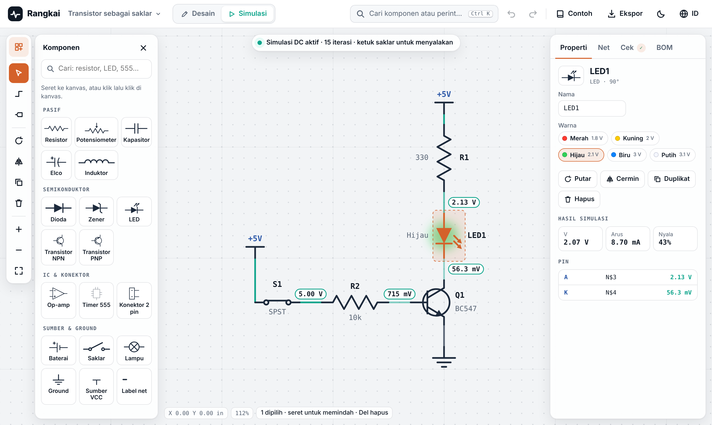
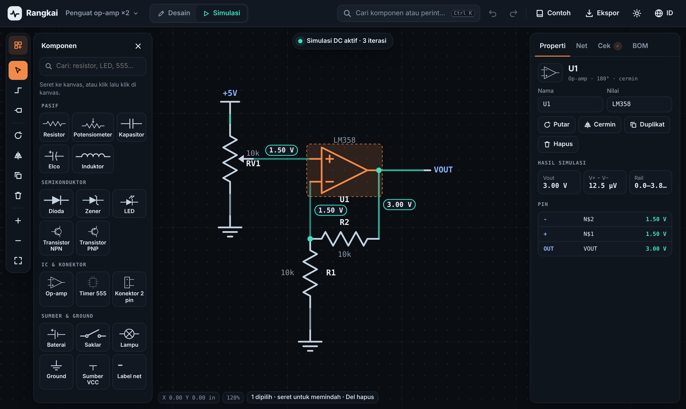
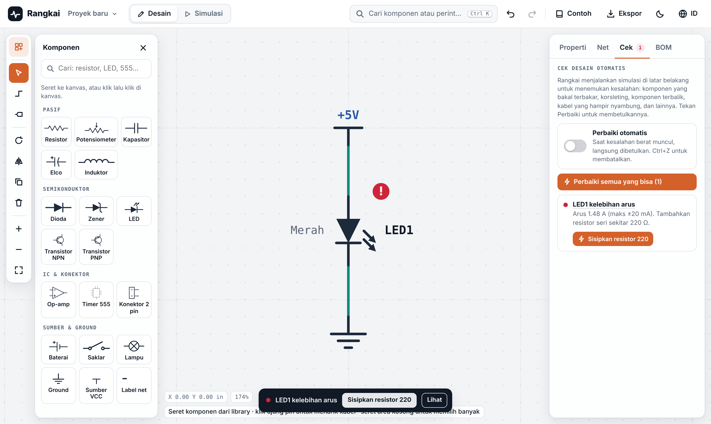
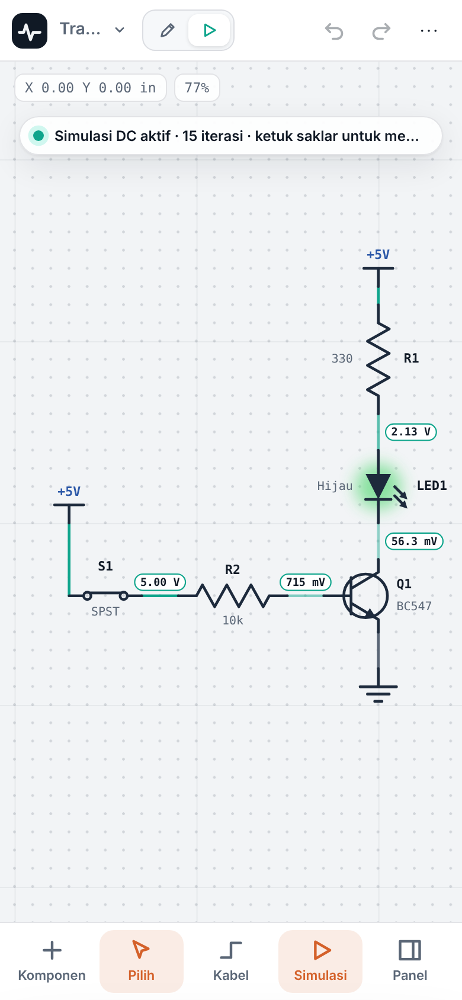

# Rangkai

**Editor skematik + simulator rangkaian listrik di browser.** Gratis, tanpa akun, nyaman di HP sampai desktop, dan bisa mendeteksi lalu memperbaiki kesalahan rangkaian secara otomatis.

Cuma satu file: `index.html`. Buka di browser, langsung jalan.



---

## Kenapa Rangkai?

Sudah ada banyak editor dan simulator rangkaian online, tapi masing-masing punya celah:

| Alat | Celahnya | Di Rangkai |
|---|---|---|
| EasyEDA | Wajib online dan akun. [Di HP Android proyek tampil kosong atau sangat terbatas](https://easyeda.com/forum/topic/Easy-Eda-on-mobile-devices-5884efc7e8504d8cad855424b82fa970) | Tanpa akun, didesain untuk layar sentuh |
| CircuitLab | [Versi gratis diganggu pop-up tiap ~10 menit](https://www.circuitlab.com/forums/support/topic/ruzyj4vy/circuit-lab-used-to-be-useful/) | Gratis penuh, tanpa pop-up |
| Scheme-it | Hanya menggambar, tanpa simulasi | Simulasi DC live di skematik yang sama |
| Falstad CircuitJS | [Komponen ideal](https://lushprojects.com/circuitjs/), gambar bukan skematik standar | Simbol skematik standar, model komponen lebih realistis |
| EveryCircuit | [Versi gratis dibatasi, versi penuh berbayar](https://apps.apple.com/app/id797157761) | Tanpa batas jumlah komponen |

Rangkai bukan pengganti alat profesional seperti EasyEDA atau KiCad. Fokusnya **belajar dan cek cepat rangkaian**, terutama untuk pelajar SMK, mahasiswa, dan hobiis.

## Fitur

### Menggambar skematik
- 19 komponen: resistor, potensiometer, kapasitor, elco, induktor, dioda, zener, LED, transistor NPN/PNP, op-amp, IC 555, konektor, baterai, saklar, lampu, ground, VCC, dan label net.
- Kabel siku otomatis yang **menghindari pin dan badan komponen**.
- Komponen yang dipindah membawa kabelnya. Komponen yang dijatuhkan di atas kabel otomatis disisipkan.
- Pilih banyak, salin, tempel, duplikat, putar, cermin, undo/redo tanpa batas.
- Netlist otomatis bergaya Eagle (`N$1`, `GND`, `+5V`), dan net bisa disorot.
- Penulisan nilai gaya lokal: `4k7`, `2R2`, `100n`, `1M`. Resistor menampilkan gelang warna dan nilai E12 terdekat.

### Simulasi DC live
- Analisis nodal termodifikasi (MNA) dengan Newton-Raphson.
- Tegangan tampil di setiap kabel. LED dan lampu menyala sesuai arus.
- Saklar bisa diketuk dan potensiometer bisa digeser saat simulasi berjalan.
- Model komponen:
  - LED dengan tegangan maju per warna dan hambatan dalam.
  - Dioda 1N4148.
  - Zener dengan tegangan tembus.
  - BJT dengan model Ebers-Moll.
  - Baterai dengan hambatan dalam.
  - Op-amp dengan batas rail.
- Kondisi transistor (mati, aktif, atau saturasi) dan hFE ditampilkan.



### Deteksi dan perbaikan kesalahan otomatis
Simulasi berjalan di latar belakang, bahkan di mode Desain, jadi kesalahan langsung ketahuan dan bisa diperbaiki dengan satu klik:

| Kesalahan | Perbaikan |
|---|---|
| LED tanpa resistor atau kelebihan arus | Menyisipkan resistor dengan nilai yang dihitung, atau mengubah resistor seri yang ada |
| Arus basis transistor terlalu besar | Menyisipkan resistor basis |
| Resistor melewati rating daya | Menaikkan rating, misalnya ke 1 W |
| LED atau elco terbalik | Membalik arah pemasangan |
| Kabel menembus pin sehingga komponen terhubung singkat | Membelokkan kabel memutari pin |
| Pin atau ujung kabel hampir nyambung | Menyambungkan ke titik terdekat |
| Tidak ada titik 0 V | Menambahkan Ground |
| `1m` (miliohm) dipakai untuk resistor | Mengganti jadi `1M` |
| Nama komponen dobel atau komponen bertumpuk | Mengganti nama, atau menggeser ke tempat kosong |

Peringatan menunjuk ke **penyebab utamanya**. Contohnya, yang muncul adalah "LED1 kelebihan arus, ubah R1 jadi 220", bukan "R1 kepanasan". Mode **Perbaiki otomatis** bisa diaktifkan supaya kesalahan berat langsung dibetulkan, dan semuanya bisa dibatalkan dengan `Ctrl+Z`.



### Ekspor dan proyek
- **SPICE netlist** (`.cir`) untuk LTspice, ngspice, atau KiCad.
- **BOM** dalam CSV, dengan komponen bernilai sama dikelompokkan.
- **SVG** untuk laporan, slide, Figma, atau Inkscape.
- **JSON** untuk cadangan dan pindah perangkat.
- Banyak proyek sekaligus, tersimpan otomatis di browser.
- 6 contoh rangkaian siap simulasi.

### Nyaman di semua layar


- **HP:** dock bawah, panel geser dari bawah, zoom dan geser dua jari, tahan lama untuk menu konteks, tarik kabel dengan menyeret dari pin ke pin.
- **Tablet dan laptop:** panel bisa dilipat.
- **Desktop:** seret komponen dari library, pilih banyak dengan kotak, dan pintasan keyboard.
- Bahasa Indonesia dan English, tema terang dan gelap.

<br clear="right">

## Cara pakai

**Langsung:** unduh `index.html`, lalu buka di browser (Chrome, Edge, Safari, atau Firefox).

**Online lewat GitHub Pages:** Settings → Pages → Source: *Deploy from a branch* → Branch `main`, folder `/ (root)` → Save. Situsnya aktif di `https://<username>.github.io/rangkai/`.

### Pintasan keyboard

| Tombol | Fungsi |
|---|---|
| `V` / `W` / `N` | Pilih / Kabel / Label net |
| `R` / `M` | Putar 90° / Cermin |
| `B` | Ganti arah tekukan kabel |
| `S` | Simulasi on/off |
| `F` | Muat semua ke layar |
| `Ctrl K` atau `/` | Cari komponen dan perintah |
| `Ctrl Z` / `Ctrl Y` | Urungkan / Ulangi |
| `Ctrl C` / `Ctrl V` / `Ctrl D` | Salin / Tempel / Duplikat |
| `Shift` + klik | Tambah ke pilihan |
| `Space` + seret | Geser kanvas |
| Panah | Geser komponen terpilih |

## Batasan saat ini

- Simulasi baru **DC** (kondisi stabil). Belum ada analisis transien, AC, atau osiloskop.
- IC 555 bisa digambar tetapi belum disimulasikan.
- Proyek tersimpan di browser masing-masing perangkat. Gunakan Ekspor → JSON untuk memindahkan.
- Belum ada editor PCB dan simulasi mikrokontroler.

## Rencana

- [ ] Simulasi transien + osiloskop (kapasitor, induktor, 555)
- [ ] Animasi arus mengalir
- [ ] Link berbagi rangkaian
- [ ] Komponen baru: MOSFET, relay, gerbang logika, sensor
- [ ] Impor netlist SPICE

## Struktur

```
rangkai/
├── index.html      # seluruh aplikasi: UI, simulator, contoh rangkaian
├── docs/           # screenshot untuk README
├── CHANGELOG.md
└── LICENSE
```

Tanpa build step dan tanpa dependensi. Font dimuat dari Google Fonts. Kalau sedang offline, aplikasi memakai font bawaan sistem.

---

## English

**Rangkai** is a single-file, in-browser schematic editor with a live DC circuit simulator. It needs no account, works on phones, tablets and desktops, and comes in Indonesian and English. A background simulation flags real mistakes and fixes them in one click. Examples include an over-driven LED (it inserts a correctly sized resistor), parts in backwards, near-miss wires, missing ground, and resistors over their power rating. You can export to SPICE, a CSV BOM, SVG or JSON. To use it, open `index.html` in any modern browser.

## Lisensi

[MIT](LICENSE)
